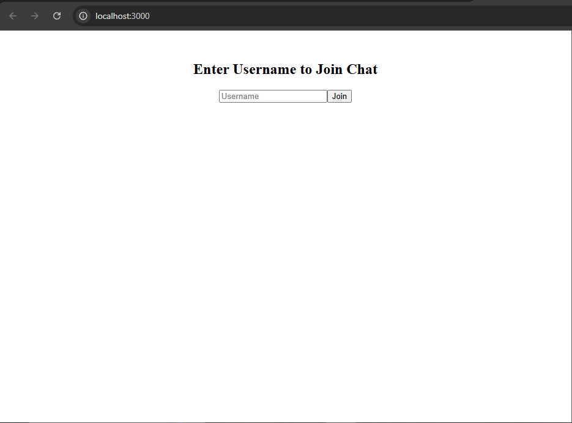
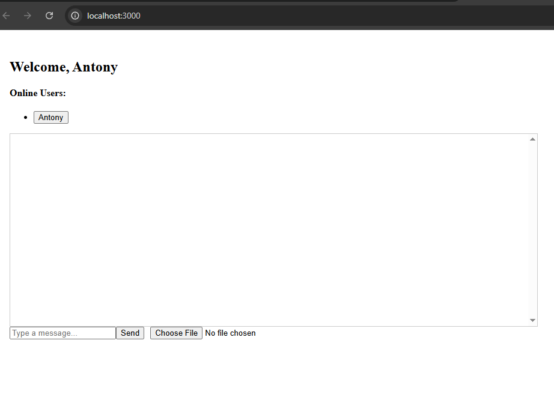
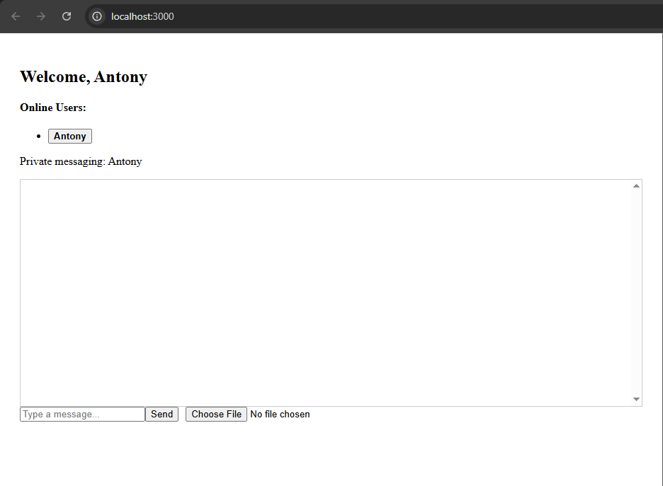
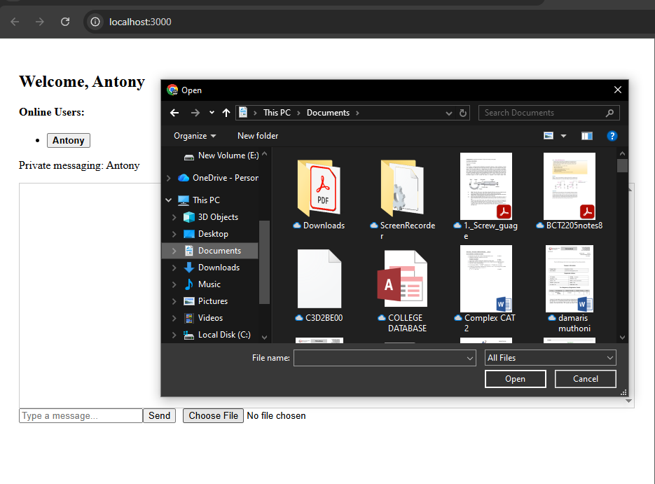

Socket.io Real-Time Chat Application
Project Overview

This project is a real-time chat application built using Node.js, Express, Socket.io, and React.
It demonstrates bidirectional communication between clients and server with advanced chat features including private messaging, file sharing, message reactions, typing indicators, and browser notifications.

Features Implemented
Core Features

Username-based login

Global chat room

Online/offline users list

Typing indicator

Timestamped messages

Real-time notifications

Advanced Features

Private messaging between users

Message reactions (👍, ❤️)

File and image sharing

Browser notifications for new messages

Project Structure
socketio-chat/
├── client/                 # React front-end
│   ├── public/
│   ├── src/
│   │   ├── components/     # Chat.jsx, Login.jsx
│   │   ├── context/        # UserContext.jsx
│   │   ├── socket/         # socket.js
│   │   └── App.jsx
│   └── package.json
├── server/                 # Node.js + Express + Socket.io backend
│   ├── server.js
│   └── package.json
└── README.md

Setup Instructions
1. Clone the Repository
git clone <YOUR_REPO_URL>
cd socketio-chat

2. Server Setup
cd server
npm install
npm run dev

Server runs on http://localhost:5000

3. Client Setup
cd client
npm install
npm start

Client runs on http://localhost:3000

How to Use

Open the app in multiple browser tabs or devices.

Enter a username to join the chat.

Use the message input to send messages.

Select a user from the online users list to send a private message.

Click 👍 or ❤️ on messages to react.

Upload files or images using the file input.

Typing indicators and browser notifications alert you to new activity.

Screenshots
### Login Screen

### Global Chat

### Private Messaging

### File Sharing

Tech Stack

Frontend: React, Socket.io-client

Backend: Node.js, Express, Socket.io

Other: CSS for styling, Browser Notifications API